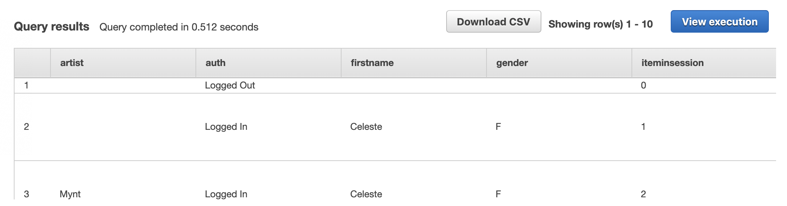
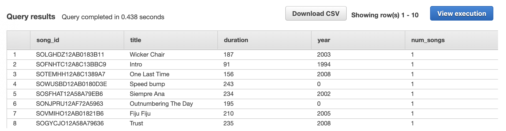
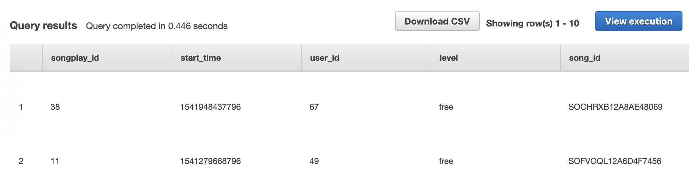
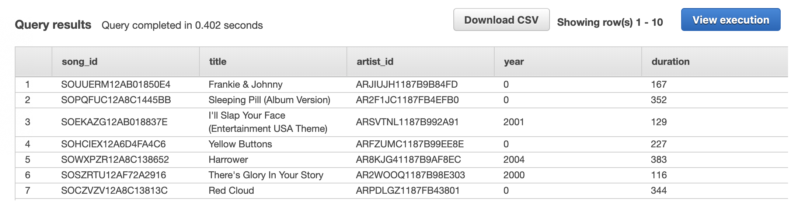
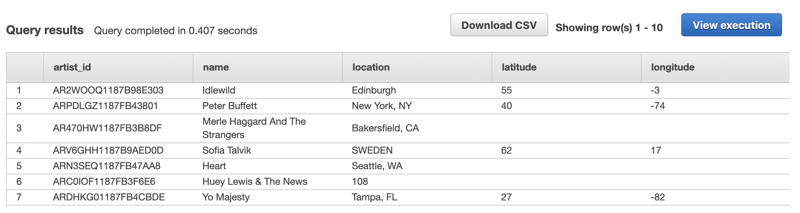
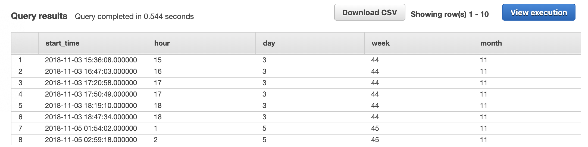
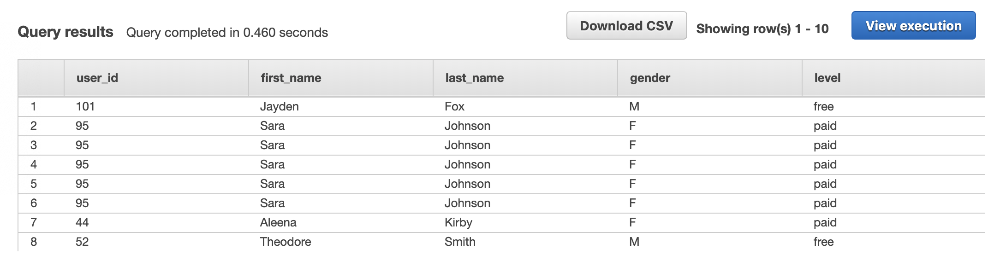

## Introduction
In this project, we use data residing in S3, in a directory of JSON logs on user activity on app and also metadata in the app.

We build an ETL pipeline that extracts their data from S3, stages them in Amazon Redshift, and transforms data into a set of dimensional tables for their analytics team to continue finding insights in what songs their users are listening to. 

## How To Run the Program
- Add your own data warehouse config file `dwh.cfg`
```
> python create_tables.py
> python etl.py
```

## Files Description
- create_tables.py:  
Connects to database, create or drops table if exists.

- sql_queries.py:
SQL(Redshift) query to create, insert table.

- etl.py:
ETL pipeline, loading table to stage on Redshift and create star schema table.

## Dataset
1. Song Dataset
This dataset is a subset of real data from the Million Song Dataset.
Here is an example of song data
```javascript
{"num_songs": 1, "artist_id": "ARJIE2Y1187B994AB7", "artist_latitude": null, "artist_longitude": null, "artist_location": "", "artist_name": "Line Renaud", "song_id": "SOUPIRU12A6D4FA1E1", "title": "Der Kleine Dompfaff", "duration": 152.92036, "year": 0}
```

2. Log Dataset
The log dataset consists of log files in JSON format generated by this event simulator based on the songs in the dataset above. These simulate activity logs from a music streaming app based on specified configurations. Here's an example of log data


## Results
We show the first few data of each table
*staging_events*


*staging_songs*


*songplays*


*songs*


*artists*


*time*


*users*


